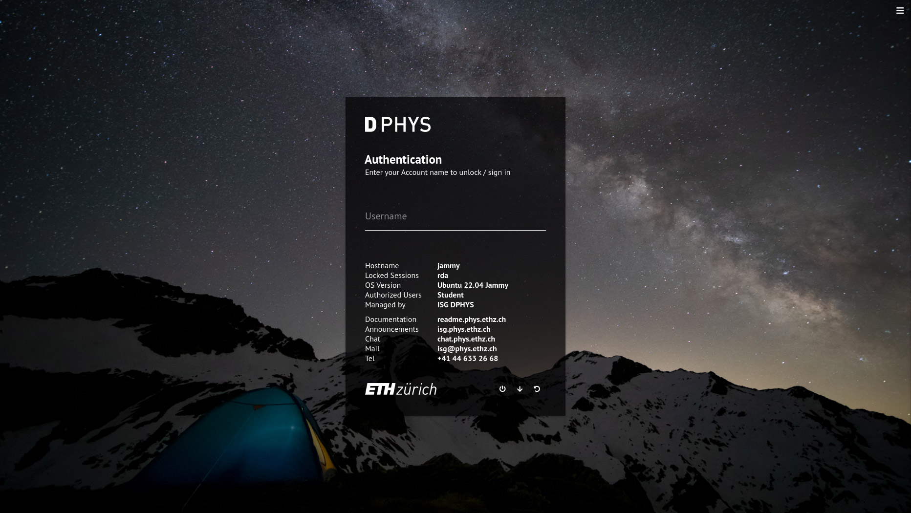
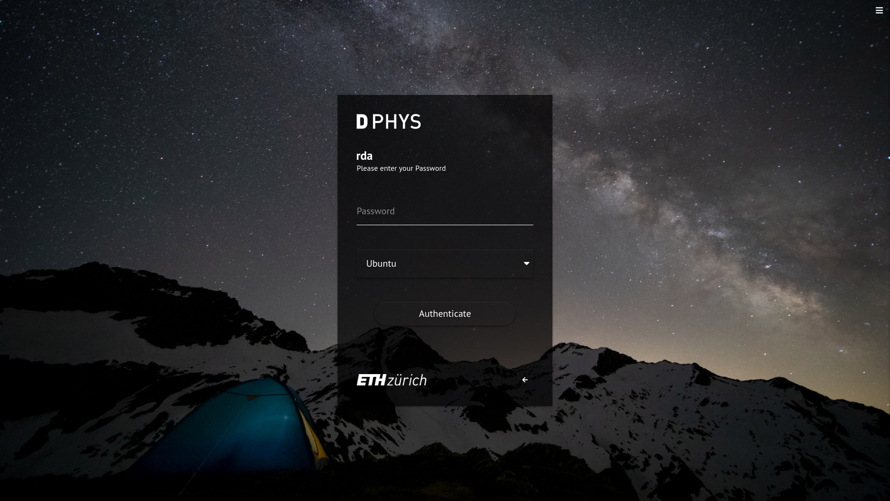

# web-greeter-theme-luminosity

A theme for [Web Greeter](https://github.com/JezerM/web-greeter)

## Overview

Customizable LightDM Web Greeter theme based on the design of [luminos](https://github.com/muhammadsayuti/lightdm-webkit-theme-luminos) by (Muhammad Sayuti) which was based on the [official LightDM Webkit Greeter theme](https://github.com/Antergos/lightdm-webkit-theme-antergos) of [Antergos Linux](http://antergos.com).

This dark theme was built for use on Linux Workstations at the [Department of Physics ETH Zurich](https://www.phys.ethz.ch/), because there was no suitable theme available that would allow us to use it in combination with a central authentication provider like LDAP or Kerberos. Other themes present a list of users to select from, as it is done with the default LightDM configuration, which does just not scale with our currently active 2464 LDAP user accounts :)

## Credits

Many thanks to the following guys for their support on this project.

- Claude Becker ([upekkha](https://github.com/upekkha))
- Anastassios Martakos ([realmar](https://github.com/realmar))
- Christian Herzog ([daduke](https://github.com/daduke))
- Alex Myczko ([alexmyczko](https://github.com/alexmyczko))
- Janosch Bühler ([WitteShadovv](https://github.com/WitteShadovv))

## Features

- Works with [web-greeter](https://github.com/Antergos/web-greeter) 3.4.0
- Username promt (no userlist)
- Customizable configuration
- Shows the hostname
- Shows currently active lighdm user sessions (when locked)
- Shows useful static information
- Short feedback after authenticating (success/failure)
- Drop-down list for session selection
- Wallpaper changer (todo)

## Screenshots




## Prerequisites

- `lightdm`
- `web-greeter` ([releases](https://github.com/JezerM/web-greeter/releases))

### Configuration

Enable `web-greeter` by editing `/etc/lightdm/lightdm.conf` and setting `greeter-session` property to `web-greeter`:

```
[Seat:*]
greeter-session=web-greeter
greeter-show-manual-login=true
greeter-hide-users=true
user-session=ubuntu
allow-guest=false
```

To select another screen for the lightdm greeter in a multimonitor configuration, add the following line:

```
display-setup-script=xrandr --output <id> --primary
```

while `<id>` is the screen, use `xrandr` to list your screen ids.

## Installation

Clone the theme to `/usr/share/web-greeter/themes/luminosity`:

```sh
cd /usr/share/web-greeter/themes
git clone https://github.com/rda0/web-greeter-theme-luminosity.git luminosity
```

To select luminosity as default theme just change the `greeter.theme` property in `/etc/lightdm/web-greeter.yml` to `luminosity`::

```
greeter:
  debug_mode: False
  detect_theme_errors: True
  screensaver_timeout: 300
  secure_mode: True
  theme: luminosity
  icon_theme:
  time_language:
```

Now restart `lightdm`:

```
systemctl restart lightdm.service
```

## Configuration

The theme configuration is read from `branding.theme` (optional), example:

```yaml
branding:
  background_images_dir: /usr/share/backgrounds
  logo_image: /usr/share/web-greeter/themes/default/img/antergos-logo-user.png
  user_image: /usr/share/web-greeter/themes/default/img/antergos.png
  theme:
    username_area:
      title: Authentication
      title_locked: Authentication
      comment: Enter your Account name to sign in
      comment_locked: Enter your Account name to unlock / sign in
    password_area:
      comment: Please enter your Password
    active_sessions_label: Locked Sessions
    info_top:
      - label: OS Version
        value: Ubuntu 22.04 Jammy
      - label: Authorized Users
        value: Student
      - label: Managed by
        value: ISG DPHYS
    info_bottom:
      - label: Documentation
        value: readme.phys.ethz.ch
      - label: Announcements
        value: isg.phys.ethz.ch
      - label: Chat
        value: chat.phys.ethz.ch
      - label: Mail
        value: isg@phys.ethz.ch
      - label: Tel
        value: '+41 44 633 26 68'
    banner: dphys
    logo: ethz
    styles:
      panel:
        position: 'absolute'
        width: '450px'
        top: '50%'
        left: '50%'
        transform: 'translate(-50%, -50%)'
      content:
        height: '541px'
      panels_shadow:
        boxShadow: '0 2px 2px 0 rgba(0, 0, 0, 0.14), 0 3px 1px -2px rgba(0, 0, 0, 0.12), 0 1px 5px 0 rgba(0, 0, 0, 0.2)'
      panels_color:
        background: 'rgba(0,0,0,.7)'
        color: '#fff'
      status_panel:
        background: 'rgba(143,0,17,.6)'
        color: '#fff'
      status_panel_granted:
        background: 'rgba(66,133,244,.6)'
      status_panel_granted_green:
        background: 'rgba(66,244,95,.6)'
      status_panel_denied:
        background: 'rgba(143,0,17,.6)'
      contentFooter:
        paddingTop: '0px'
      background:
        backgroundPosition: 'center'
        backgroundSize: 'cover'
```

## Using light-locker

You may also want to install `light-locker` to replace `gnome-screensaver` to show the Web Greeter lock screen after automatic session lock.

### Installation

```sh
apt purge gnome-screensaver
apt install python-gi python3-pyside
apt install light-locker light-locker-settings
```

### Configuration

Remove the line starting with `NotShowIn=` in `light-locker.desktop` to start `light-locker` also in gnome:

```sh
sed -i '/NotShowIn=/d' /etc/xdg/autostart/light-locker.desktop
```

Disable gnome screensaver proxy:

```
cat > /etc/xdg/autostart/org.gnome.SettingsDaemon.ScreensaverProxy.desktop << EOF
[Desktop Entry]
Hidden=false
EOF
```

Now kill the screensaver (if it is running) and then restart `lightdm`.

### User configuration

The user can configure `light-locker` with the settings panel `light-locker-settings`.

To check if `light-locker` works:

```sh
$ light-locker-command -q
The screensaver is inactive  (means: it is running)
$ light-locker-command -l
# this will lock the screen
```

You may also use `loginctl lock-session` to lock your screen.

## Uninstallation

To uninstall, simply restore the `greeter-session` property of the `/etc/lightdm/lightdm.conf` file and restart your computer (or at least lightdm).

You may also want to:

- Remove the folder `luminosity` which was created in `/usr/share/lightdm-webkit/themes/`
- Restore the `webkit-theme` property of the `/etc/lightdm/lightdm-webkit-greeter.conf` file
