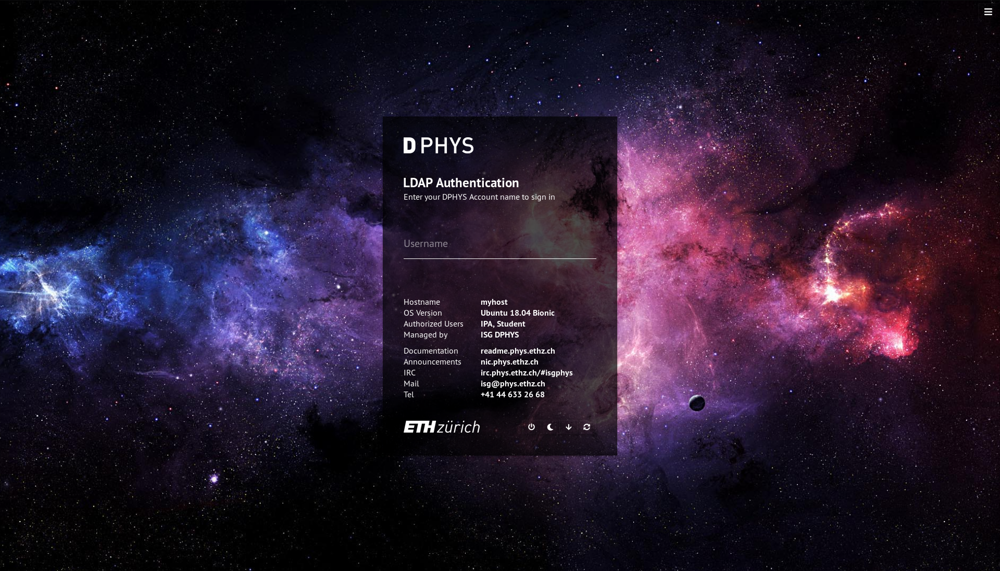
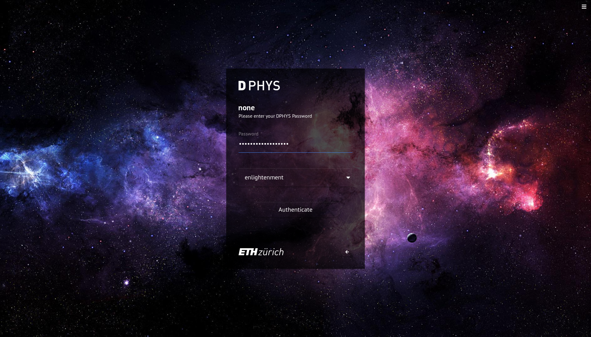

# web-greeter-theme-luminosity

## Overview

Customizable LightDM Web Greeter theme based on the design of [luminos](https://github.com/muhammadsayuti/lightdm-webkit-theme-luminos) by (Muhammad Sayuti) which is based on the [official LightDM Webkit Greeter theme](https://github.com/Antergos/lightdm-webkit-theme-antergos) of [Antergos Linux](http://antergos.com)

This dark theme was built for use on Linux Workstations at the [Department of Physics ETH Zurich](https://www.phys.ethz.ch/), because there was no suitable theme available that would allow us to use it in combination with a central authentication provider like LDAP or Kerberos. Other themes present a list of users to select from, as it is done on the default LightDM configuration, which does just not scal with our currently active 1728 LDAP users :) Most of the javascript code had to be rewritten to replace the userlist with a username prompt.

## Features

- Username promt (no userlist)
- Customizable configuration (see `config.json`)
- Uses updated [JavaScript API](https://doclets.io/Antergos/web-greeter/stable) of [Web Greeter for LightDM](https://github.com/Antergos/web-greeter)
- Shows the hostname
- Shows currently active lighdm user sessions (when locked)
- Shows useful static information
- Short feedback after authenticating (success/failure)
- On screen logging (only in debug mode)
- Drop-down list for session selection
- Wallpaper changer

## Screenshots




## Prerequisites

- `lightdm`
- `lightdm-webkit2-greeter`

Installation packages of `lightdm-webkit2-greeter` for Ubuntu (and other distros) can be found [here](https://github.com/Antergos/web-greeter).

### Package installation

For example to install it from their apt repo (Also working for `Bionic`), run the following commands as `root`:

```sh
apt-key adv --fetch-keys https://download.opensuse.org/repositories/home:antergos/xUbuntu_17.10/Release.key
echo "deb http://download.opensuse.org/repositories/home:/antergos/xUbuntu_17.10/ /" > /etc/apt/sources.list.d/antergos.list
echo "deb-src http://download.opensuse.org/repositories/home:/antergos/xUbuntu_17.10/ /" >> /etc/apt/sources.list.d/antergos.list
apt update
apt install lightdm lightdm-webkit2-greeter
```

### Build instructions

You may also build it from source:

```sh
git clone https://github.com/Antergos/web-greeter.git /tmp/web-greeter
cd /tmp/web-greeter/build
git tag
# checkout the latest stable tag
git checkout 2.2.5
apt install meson gcc build-essential pkg-config libdbus-glib-1-dev liblightdm-gobject-1-dev libwebkit2gtk-4.0-dev libxml2-utils
meson --prefix=/usr --libdir=lib ..
ninja
ninja install
```

### Configuration

Enable `lightdm-webkit2-greeter` by editing `/etc/lightdm/lightdm.conf` and setting `greeter-session` property to `lightdm-webkit2-greeter`:

```
[SeatDefaults]
greeter-session=lightdm-webkit2-greeter
greeter-show-manual-login=true
greeter-hide-users=true
user-session=ubuntu
allow-guest=false
```

# Installation

Clone the theme to `/usr/share/lightdm-webkit/themes/luminosity`:

```sh
cd /usr/share/lightdm-webkit/themes
git clone https://github.com/rda0/web-greeter-theme-luminosity.git luminosity
```

To select luminosity as default theme just change the `webkit-theme` property in `/etc/lightdm/lightdm-webkit2-greeeter.conf` to `luminosity`:

```
# Example configuration

[greeter]
debug_mode          = false
detect_theme_errors = true
screensaver_timeout = 300
secure_mode         = true
time_format         = LT
time_language       = auto
webkit_theme        = luminosity
```

Now restart `lightdm`:

```
systemctl restart lightdm
```

# Wallpapers

To add more background wallpapers, copy the `jpg` files to `img/wallpapers` and run the script `generate-images.py`. This will generate thumbnails in `img/thumbs` and the metadata in `config.json`.

# Using light-locker

You may also want to install `light-locker` to replace `gnome-screensaver` to show the Web Greeter lock screen after automatic session lock.

Installation:

```sh
apt remove gnome-screensaver
apt install python-gi python3-pyside
apt install light-locker light-locker-settings
```

At the moment you need an ugly workaround (better solution will hopefully follow):

```
rm /usr/lib/gnome-settings-daemon/gsd-screensaver-proxy
sed -i '/NotShowIn=/d' /etc/xdg/autostart/light-locker.desktop
```

Now kill the screensaver (if it is running) and then restart `lightdm`.

The user can configure `light-locker` with the settings panel `light-locker-settings`.

To check if `light-locker` works:

```sh
$ light-locker-command -q
The screensaver is inactive  (means: it is running)
$ light-locker-command -l
# this will lock the screen
```

# Uninstallation

To uninstall, simply restore the `greeter-session` property of the `/etc/lightdm/lightdm.conf` file and restart your computer (or at least lightdm).

You may also want to:

- Remove the folder `luminosity` which was created in `/usr/share/lightdm-webkit/themes/`
- Restore the `webkit-theme` property of the `/etc/lightdm/lightdm-webkit-greeter.conf` file
